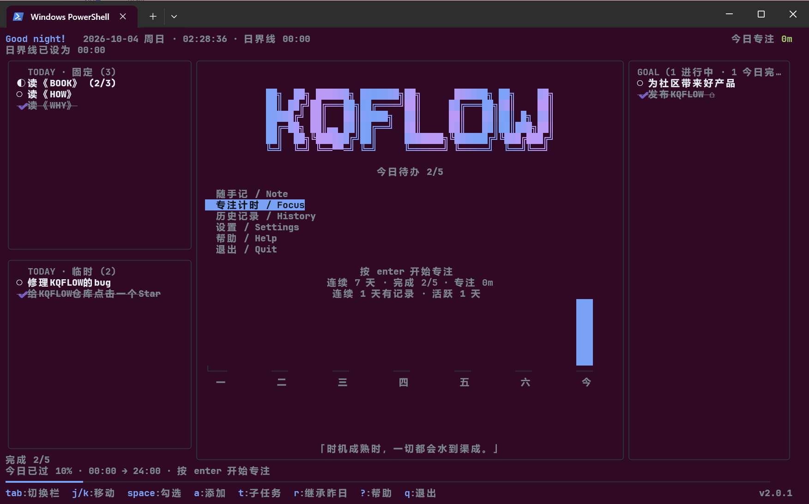

# KQFLOW — The-KQFLOW-Time-manager

[](LICENSE)
[](https://go.dev)
[](#安装)

> A command-line tool that integrates time management and a TODO list, built with Go.
>
> 每天向前一点的时间管理器：每日 TODO、长期 GOAL、番茄钟与专注计时、随手记、历史统计，全部装在一个终端看板里。

KQFLOW 是一个用 Go 编写的命令行时间管理工具。它编译成**单个可执行文件**，不依赖运行环境；数据以可读的 JSON 存在本地，不上传任何地方。

> [!IMPORTANT]
> **当前版本 v2.1.0 的定位是原型**：核心功能都可用，但**宽终端下长段文字的排版仍有已知缺陷**（观感受损，不丢数据）。
> 根因是界面缺少统一的渲染层——同一个"文字显示不全"的问题连续修了四轮都没根治，因此我们决定**停止打补丁**，把渲染层重写列为 3.0 的目标。
> 详细的问题清单与下一步计划见 **[开发计划](ROADMAP.md)**。



> 三栏看板：左栏固定/临时 TODO、中间栏 KQFLOW 渐变艺术字与功能菜单、右栏 GOAL；底部是当日进度条、快捷键提示与版本号。
> 截图用的是 Windows PowerShell 默认配色。

## 安装

### 方式一：安装程序（推荐）

到 [Releases](https://github.com/kqin-dev/The-KQFLOW-Time-manager/releases) 下载 `KQFLOW-<版本>-setup.exe`，双击运行。

安装向导会：

- **让你自选安装位置**。默认是 `C:\Program Files\KQFLOW`。如果不小心选了桌面、下载、临时目录这类位置，向导会提醒你换一个——放在这些地方容易被清理掉，也不方便升级。
- **默认勾选「加入 PATH」**。请保持勾选，这样在任意终端直接输入 `kqf` 就能启动；取消时会再提醒一次。
- 可选创建桌面快捷方式（默认不勾）。

安装包支持**直接覆盖升级**：新版本装到同一位置即可，**你的数据不会被覆盖或删除**。如果你换了安装目录，向导会检测到旧数据并询问是否复制过去（旧目录里的数据始终保留，不会被删）。

卸载时会问你数据怎么处理，**默认保留**；要删除必须再确认一次。

### 方式二：绿色版（免安装）

下载 `kqf.exe` 放到任意目录，把该目录加入 `PATH`，然后：

```powershell
kqf
```

数据会存在 `kqf.exe` 同级的 `kqflow-data` 目录里，整个目录可以随便拷贝到别的机器。

### 方式三：从源码构建

```powershell
git clone https://github.com/kqin-dev/The-KQFLOW-Time-manager.git
cd The-KQFLOW-Time-manager
go build -trimpath -ldflags "-s -w" -o kqf.exe ./cmd/kqf
```

需要 **Go 1.24 或更高版本**。项目只依赖 [Bubble Tea](https://github.com/charmbracelet/bubbletea) 与 [Lipgloss](https://github.com/charmbracelet/lipgloss)，构建产物是纯静态单文件（约 4.3 MB）。

自己打安装包见 [setup/](setup/)：

```powershell
pwsh -File setup\build-installer.ps1
```

## 看板结构

| 区域 | 内容 |
| --- | --- |
| 顶栏 | 按时段变化的问候语、当前逻辑日与星期、系统时间、今日专注时长 |
| 左栏上 | **TODAY · 固定**：长期坚持的事项，每天自动出现（带独立边框） |
| 左栏下 | **TODAY · 临时**：当天临时安排，可选择性继承昨日未完成项（带独立边框） |
| 中间栏 | KQFLOW 渐变 ASCII 艺术字、今日完成度、功能选项、随手记预览、连续 7 天统计、随机字条 |
| 右栏 | **GOAL**：与日程无关的长期目标，完成后归档到当天 |
| 底栏 | 时段看条、按键提示、版本号 |

固定与临时是两个独立的带边框面板，`TAB` 切到哪一半，哪一半的标题会出现醒目的焦点标记并把边框高亮——即使在只支持 16 色的终端里也能分辨（焦点标记用字符而不是只靠颜色，因为低色彩终端会把两种边框色渲染成同一个）。

界面分两层布局，全部复用同一块中间栏，任何弹窗都不会把边框画花：

- **主看板**：三栏并排（左侧 TODO / 中间菜单 / 右侧 GOAL）。
- **二级内容**一律只占用**中间栏**——计时菜单、输入框、继承确认，以及帮助、设置、历史都在这里显示。左右两侧的 TODO 与 GOAL 始终可见、边框完整。
- 二级内容高于中间栏时可用 `j` / `k` 滚动；设置页会让光标所在项始终留在可视区内。

窗口小于 60×16 时会显示提示而不是硬挤排版（提示本身也会裁剪到窗口内）。

## v2.1.0 新增

相对 2.0.1，这一版加了四块功能与两处保护：

| 功能 | 说明 |
| --- | --- |
| **标签** | TODO / GOAL 可打标签（内置若干预设 + 自定义），用于标记与显示 |
| **截止时间（DDL）** | TODO 设时间点、GOAL 设日期；右栏下多出一块 DDL 面板，列出进行中的截止项与倒计时 |
| **收藏自定义方案** | 编好的自定义时段可以存下来复用，也能当模板改 |
| **时段切换提醒** | 三种按"注意力距离"分档的提醒，各自可开关：**流光**（做在 LOGO 上）、**提示音**（系统响铃）、**手机推送**（ntfy，离机时用） |
| **数据版本保护** | 数据文件来自更新版本的程序时**拒绝启动并说明原因**，不再让老程序误读新数据 |
| **计时保护** | 计时进行中再次启动计时会被拒绝（旧行为会静默丢弃正在进行的时长） |

设置页新增了一个「提醒 · 测试」：按 enter 立刻演示一次流光 + 提示音 + 推送，并告诉你哪几项因为没打开而跳过。手机推送只需在手机上装 ntfy 并订阅设置页显示的频道名，**不需要注册账号**。

## 已知问题

完整清单与说明见 **[开发计划](ROADMAP.md)**。摘要：

| 问题 | 影响 |
| --- | --- |
| 宽终端下长段文字（尤其风险声明）换行观感不佳，看起来像被截断 | 观感，**不丢数据**；已缓解未根治 |
| 提示音用终端响铃（`\a`），部分终端或系统设置下不响 | 提示音可能听不到，程序侧无法检测 |
| 界面只在 Windows 终端上验证过 | 其它平台可能观感不同 |

如果你遇到**排版类**问题，请在 Issue 里**附上截图并写明终端宽高**——这类问题只在特定宽度下出现，没有宽高基本无法定位。

## 开发计划

下一步是把界面重写成**分层的渲染引擎（KXFLOW）**，让布局只有一处权威实现，并且
在渲染前就强制保证「不超宽、不超行、不越界」，从结构上消除上面那类排版问题；
同时为后续的**社区插件**（磁贴式扩展）打好接口基础。

设计构想与分层方案见 **[ROADMAP.md](ROADMAP.md)**。当前版本的功能与数据格式保持稳定，
3.0 主要替换布局与渲染层，业务逻辑尽量平移。

**ASCII 艺术字有三档字号，按可用宽度自动切换**，绝不被折行撕碎：

| 字号 | 宽度 | 出现条件 |
| --- | --- | --- |
| 完整版 | 52 列 | 终端 ≥ 120 列 |
| 紧凑版 | 23 列 | 中间栏放不下完整版时 |
| 迷你版 | 17 列 | 中间栏很窄时 |

中间栏的最小宽度是按**内容**定的（帮助、设置、历史、统计都挤在这里），
不是按字模定的——所以窄终端上会看到小一号的字，而不是被压扁的排版。

## 快捷键

### 导航

| 按键 | 作用 |
| --- | --- |
| `tab` / `shift+tab` | 循环切换栏位（中间菜单 → 左固定 → 左临时 → 右 GOAL），**这是唯一的栏位切换方式** |
| `j` / `k`、`↑` / `↓` | 在当前栏内上下移动 |
| `g` / `G` | 跳到首项 / 末项 |
| `enter` | 进入选中条目的子任务；再按 `enter` 勾选子任务 |
| `esc` | 从子任务退回父条目 |
| `1` / `2` / `3` | 直接跳到固定 TODO / 临时 TODO / GOAL |

### 编辑

| 按键 | 作用 |
| --- | --- |
| `space` | 勾选选中项；在子任务模式下勾选子任务 |
| `a` | 添加 TODO（焦点在固定栏则加固定项，否则加临时项） |
| `A` | 添加 GOAL |
| `e` | 重命名选中条目 |
| `t` | 为选中条目添加子任务 |
| `d` | 删除选中条目（会先确认） |
| `r` | 从昨日继承：固定 / 未完成 / 两者 |
| `l` | 给选中条目打标签（见 [标签](#标签)） |
| `D` | 给选中条目设截止时间（见 [截止时间](#截止时间ddl)） |
| `N` | 打开随手记 / 日记（多行编辑器） |

### 计时

| 按键 | 作用 |
| --- | --- |
| `enter`（中间栏） | 打开计时菜单：番茄钟 / 倒计时 / 正计时 / 自定义 |
| `space` | 计时中暂停或继续 |
| `enter` | 计时中结束，并把实际时长归档到所属 TODO |
| `esc` | 计时中中断，已用时长仍会记录 |

计时开始前会先让你选择这次计时归属于哪个 TODO，也可以选择不归属。无论正常结束还是中途打断，实际时长都会写入当天的记录并累计到该条目的活动时长。

**番茄钟**的专注时长、休息时长、段数全部由设置页决定，默认 25 分钟专注 / 5 分钟休息 / 4 段（即 4 个专注 + 3 个休息，最后一段永远是专注，不会结束后又跳进休息）。倒计时也有自己的时长设置，未单独设置时跟随专注时长。自定义时段的初始方案同样取自这两项时长。

**自定义时段**是一个多段编排器，可以自己组合状态与时长，进度条会按状态类型着色：

| 按键 | 作用 |
| --- | --- |
| `j` / `k` | 选择时段 |
| `e` | 给时段改名（例如「深度工作」「散步」「复盘」） |
| `p` | 设置该段时长（分钟） |
| `t` | 切换该段类型：专注 / 休息 / 自定义 |
| `n` / `d` | 新增一段 / 删除当前段 |
| `r` | 恢复默认两段方案 |
| `enter` | 开始计时 |

### 设置页

| 按键 | 作用 |
| --- | --- |
| `j` / `k`、`↑` / `↓` | 在设置项之间移动 |
| `enter` / `e` | 编辑选中项（输入时实时显示，缓冲内容可见） |
| `g` / `G` | 跳到首项 / 末项 |
| `esc` | 返回看板 |

### 其它

| 按键 | 作用 |
| --- | --- |
| `?` | 打开 / 关闭帮助（内容过长时 `j` / `k` 滚动） |
| `q` | 退出（会先弹确认，默认选中「取消」） |
| `ctrl+c` | 立即退出 |

随手记编辑中、或计时进行中，退出的语义会变，详见 [随手记没保存就关闭 / 退出](#随手记没保存就关闭--退出)。无论如何，**退出时正在进行的计时会归档已用时长，不会白记**。

## 版本号

看板最底一行的右端、帮助页末尾、`kqf -version` 显示的都是同一个版本号：

```powershell
kqf -version      # KQFLOW 2.1.0
```

版本号只有一个权威来源：`internal/version/version.go`。**发布新版本只需改这一处**，界面与命令行会一起更新。需要给某次构建打不同版本号时用 `-ldflags` 覆盖：

```powershell
go build -trimpath -ldflags "-s -w `
  -X github.com/kqin-dev/The-KQFLOW-Time-manager/internal/version.Version=2.1.0-rc1" `
  -o kqf.exe ./cmd/kqf
```

## 输入中文 / 输入法

**可以直接用输入法打字**。中文、日文等需要组字的输入法在 Windows 终端里能正常工作，上屏结果会正常进入输入框。

唯一的区别是**组字窗口的位置**：终端不向程序报告光标坐标，所以输入法的候选词窗口不会跟在光标旁边，而是贴在终端窗口的某个角落（通常是左上或左下）。文字一点不差地进到输入框，只是候选窗的位置看着有点远。**这不影响使用，习惯一下就好。**

如果你更习惯先写好再贴，粘贴同样支持：

1. 在别处（记事本、浏览器…）打好中文，`Ctrl+C` 复制；
2. 回到 KQFLOW，按 `a` / `A` / `e` 或 `N` 打开输入框；
3. `Ctrl+V` 粘贴，中文会整段进入输入框。

单行输入框里粘贴的多行文本会自动折成一行（换行变空格），不会被当成多个条目；随手记这类多行输入框则保留换行。输入框内 `Backspace` / 方向键 / `Ctrl+U` 清空 / `Ctrl+W` 删词都可用。

另外 KQFLOW **默认不接管鼠标**：一旦接管，终端就无法用鼠标选中文本，会给「复制粘贴」带来不便。需要鼠标可在 `config.json` 里把 `mouse` 设为 `true`。

> 这些表现来自终端与输入法之间的交互方式，不是 KQFLOW 能控制的：程序只收到最终上屏的字符，收不到组字过程，也无从告诉输入法光标在哪。

## 随手记 / 日记

中间栏菜单第一项是「随手记 / Note」（也可直接按 `N`）。它把中间栏变成一个多行编辑器，两边的 TODO 与 GOAL 依然可见：

| 按键 | 作用 |
| --- | --- |
| `enter` | 换行（**不是**确认，避免写日记时误提交） |
| `ctrl+s` | 保存 |
| `↑` / `↓` | 在行之间移动（保持列位置） |
| `home` / `end` | 行首 / 行尾 |
| `ctrl+u` | 清空当前行（多行模式下不会一次删光） |
| `esc` | 取消，不改动内容 |

随手记按日保存进当天的数据库文件，**第二天自动重置**为空白。默认不在看板上展示；在设置页把「看板展示随手记」打开后，中间栏会显示它的前几行（超出部分以 `…` 结尾）。

## 连续 7 天统计

中间栏底部常驻一块滚动 7 天的统计（不是自然周，是从今天往回数 7 天），柱状图是竖向的：

```
                    连续 7 天 · 完成 2/4 · 专注 1h 05m
                       连续 0 天有记录 · 活跃 4 天
                      ███
                      ███
            ███       ███
            ███       ███       ▄▄▄
  ▄▄▄       ███       ███       ███
 └───       ───       ───       ───       ───       ───       ───
   日        一        二        三        四        五        今
```

- **柱高是归一化相对高度**：最高的一天占满可用行数，其余按比例缩放——空白区高度有限，按绝对分钟数画会溢出。
- 柱值取当天**专注时长（分钟）**；当天没有专注但完成过待办时给一个最小高度，两者都没有则留空槽，一眼能看出断档。
- 用 `█` 与 `▄` 拼半格，小数值不会被压成 0。
- 柱子有实际宽度并撑满可用横向空间，不是一根细线；柱子与日期标签严格对齐（按显示列摆放，中文标签占两列也居中）。

**空间不够时按优先级分配**（用户的诉求是「要看得到柱状图」）：

1. 先保证柱状图的最小高度（表头 + 柱 + 轴 + 标签）；
2. 随手记预览随剩余空间伸缩（3 → 2 → 1 行）；
3. 都放不下时保住柱状图表头与数字，随手记只留标题。

窄终端下统计表头会压成一行（`7 天 · 2/4 · 1h 05m · 连续 0 天`），把行数让给柱子。

## 底部进度条看的是什么

没有计时时，底部那条是**当天时间流逝的比例**，与待办完成度无关：

```
今日已过 68% · 04:00 → 次日 04:00 · 按 enter 开始专注
━━━━━━━━━━━━━━━━━━━━━━━━━━━━─────────────
```

- 比例 = `(现在 - 逻辑日起点) / 24 小时`。日界线设为 04:00 时，20:31 就是 68%。
- **它和 TODO 数量无关**：把待办全删了，这个数字照样按时间走——它表示「今天还剩多少」。
- 起止时刻跨到次日时会标出「次日」，避免出现 `04:00 → 04:00` 这种看不出跨度的写法；日界线为 `00:00` 时显示为 `00:00 → 24:00`。

计时进行中时，这条会自动切换成专注进度条。

## 数据自愈

程序启动读入当天数据时，会顺手清理历史遗留的悬空引用：

- **计时记录**（`sessions`）里指向已删除条目的 `todo_ref` 会被清空，但**记录本身和时长一律保留**——历史不能被篡改。
- **投入统计**（`activity`）里对应已删除条目、且确实由上述孤儿记录产生的条目会被删除；「自由专注」这类不来自任何条目的记录保留。
- 文本里的控制字符（例如终端粘贴带进来的 `NUL`）会被清掉，避免数据文件里出现 `\u0000`。

所以早期版本删 TODO 留下的残留，会在下一次启动时自动变干净。

## GOAL 的归档规则

右栏同时展示「进行中的目标」和「今日已完成的目标」，两者是同一份列表：

- 勾选一个 GOAL 会把它从与日期无关的 `goals.json` **移动**到当天数据文件的归档里；
- 取消勾选则把它从当天归档取回 `goals.json`，完成时间与子任务状态一并重置；
- 在归档里删除它只会删掉当天那条记录，不会留下残留状态，也不会莫名回到进行中。

GOAL 完成或取消时，`goals.json` 与当天数据文件会同时写盘，两边不会出现同一目标重复存在的情况。

## 自定义随机字条

看板中间栏的字条每 12 秒轮换一次。想换成自己的话，进入「设置 → 自定义字条」，**每行写一条**，保存后立即生效；清空该栏即可恢复内置字条。字条也会按宽度自动均衡折行。

## 日界线

熬夜用户可以把「一天」的起点推后。设置页（`设置 / Settings` → `c`）把日界线设为 `04:00` 之后：

- 凌晨 2 点的工作仍然算作前一天；
- 到凌晨 4 点，TODAY TODO 才自动切换到新的一天；
- 问候语也跟着用户的作息走，凌晨 2 点仍是夜晚。

## 数据存放

数据默认放在可执行文件同级的 `kqflow-data/`，因此把 `kqf.exe` 和这个目录一起拷走就能带走全部进度。

```
kqflow-data/
  config.json      配置（日界线、默认时长、昵称、时区）
  goals.json       与日期无关的长期 GOAL
  days/
    2026-10.json   按日切分的数据库，一天一条记录
  backup/          每次写入前的自动备份，保留最近 5 个版本
```

也可以用环境变量 `KQFLOW_HOME` 或命令行参数指定位置：

```powershell
kqf --data-dir D:\my-kqflow
$env:KQFLOW_HOME = "D:\my-kqflow"; kqf
kqf --where     # 只打印当前数据目录
```

### 数据安全

终端被意外关闭不会丢数据：

- 每次写入都是「先写临时文件 → 落盘 → 原子改名」，不会留下半个 JSON；
- 每次写入前保留上一版到 `backup/`；
- 计时中断、退出、跨日都会立即落盘，进行中的计时段也会先记录再退出；
- 主文件损坏时自动回退到最近的可用备份。

## 随手记没保存就关闭 / 退出

写随手记时，**任何会关掉编辑器或退出程序的按键都不会静默丢弃内容**：

| 按键 | 有未保存改动时 |
| --- | --- |
| `esc` | 问「继续编辑 / 保存并关闭 / 不保存，关闭」 |
| `q` | 同上（关闭编辑器，不退出程序） |
| `Ctrl+C` | 同上 |
| 菜单「退出 / Quit」 | 问「取消退出 / 保存并退出 / 直接退出，丢弃改动」 |

```
随手记还没保存
  继续编辑            ← 默认选中，误触回车不会丢数据
  保存并关闭
  不保存，关闭
```

`j`/`k` 选择、`enter` 确定、`esc` 取消（等于继续编辑）。几处刻意的设计：

- **打开看一眼又原样退出**（或改回原样）不会被多问一次——只有内容真的变了才提示。
- 提示只对随手记这类**多行**输入生效。单行输入框（标题、设置项）里的 `q`
  是要输入的字符，不能被吞掉；那类输入本来就短，`esc` 直接取消是预期行为。
- 提示里**禁用 `y`/`n` 快捷键**，否则误按会把内容丢掉。
- 退出时如果计时还在跑，**已用时长仍会归档**，不会白记。

## 标签

按 `l` 给选中的 TODO / GOAL 打标签，用于标记与显示（本版**不做筛选**，只是让条目
一眼能分出类别）。内置了若干常见预设（工作 / 学习 / 生活 / 健康…），也可以自己新增。

- 一个条目最多 8 个标签，每个最多 16 个字；
- 标签是纯文本、存在条目里，不进任何索引，因此删标签不会影响别的数据；
- 退出标签页时若打了新标签，会一并落盘。

## 截止时间（DDL）

按 `D` 给条目设截止：

- **TODO** 设的是**时间点**（如 `18:30`），早于当前时间会算到次日；
- **GOAL** 设的是**日期**（如 `2026-10-20`），长期目标不需要精确到分。

设了截止的条目会出现在**右栏下方的 DDL 面板**里——它同时列出进行中的 TODO 与
GOAL，按截止时间排序并显示倒计时。临近截止（2 小时内 / 1 天内）会高亮提示。

截止时间只是提示，**不会阻止你勾选或删除条目**。

## 自定义专注方案（收藏）

「自定义时段」编好之后可以存下来反复用：

- 存下来的是**方案**（时段名、类型、时长），下次直接调用，不用重编；
- 也可以把它当**模板**：调用后临时改改再开始，不影响存下来的那份；
- 方案最多 12 段，名字最多 20 字。

## 时段切换提醒

专注计时跨过时段边界（或走完最后一段）时会提醒。三种方式按"注意力距离"分档，
**各自独立开关，默认全关**：

| 方式 | 适合 | 说明 |
| --- | --- | --- |
| **流光** | 人在屏幕前 | 做在中间栏的 LOGO 上：换更亮的配色、加快流动、首尾加 `◈` 记号 |
| **提示音** | 人在设备附近但没看屏幕 | 系统响铃（终端 `\a`） |
| **手机推送** | 人离开了设备，只带手机 | 通过 [ntfy.sh](https://ntfy.sh) 推到手机 |

设置页里有一项「**提醒 · 测试**」：按 enter 立刻演示一次，并告诉你哪几项因为没打开
而跳过——不用等真的切换时段才知道有没有生效。

### 手机推送（ntfy）

不需要注册账号：

1. 手机上装 ntfy App（应用商店搜 ntfy）；
2. 在 App 里 `Subscribe to topic`，填设置页显示的那串频道名（或直接粘贴完整地址）；
3. 保持「手机推送」为开。

频道名由程序用密码学随机数生成（32 字节熵），**不需要你自己想**——因为 ntfy 的
频道默认**全网公开**：知道名字的人都能收到、也能往里发。

> **风险提示**：ntfy.sh 是独立的第三方开源推送服务，KQFLOW 与它没有隶属或合作关系，
> 只是把消息发到你指定的地址。ntfy 的频道默认不加密、且全网可读：知道频道名的人
> 都能收到消息、也能往里发。请不要把这个频道名告诉陌生人；收到来源不明的消息不要
> 轻信。由此造成的任何损失，KQFLOW 不承担责任。

推送是**单向、尽力而为**的：失败不会重试、也不会影响计时。换频道（设置页有
「重新生成手机频道」）会让手机上的旧订阅失效，需要重新订阅一次。

## 数据版本保护

数据文件里记录了一个 `schema_version`。如果它**高于**当前程序能理解的版本
（例如你用新版写了数据、又换回旧版程序），程序会**拒绝启动**并说明原因，
而不是硬着头皮把数据读错。

这是刻意的：宁可让你看到一句明确的提示，也不要在后台悄悄把数据改坏。提示里会列出
是哪些文件、它们的版本号，以及涉及哪些程序版本。

> 数据文件的版本号与程序版本号是**两件事**：程序版本是 `2.1.0`，数据格式版本是
> 一个小整数。只有数据结构真的变了（老程序会读错）时才会提升它。

## 开发

```powershell
go test ./...                            # 全部单元测试
go vet ./...                             # 静态检查
go run ./cmd/kqf                        # 直接运行
pwsh -File setup\build-installer.ps1     # 打安装包（需要 Inno Setup 6/7）
```

测试覆盖了几处容易悄悄坏掉的地方，这些地方都曾真实出过问题：

- 日界线解析（`HH:MM` 的两字段形式）、跨月跨年换日、凌晨归属前一天；
- GOAL 完成/取消时在 `goals.json` 与当天归档之间的双向移动与落盘；
- 继承昨日固定项与未完成项、跨日自动切换、子任务勾选回写父条目；
- 数据损坏时从备份恢复、写入不留临时文件、未结束的计时不计入当日总计；
- **中文光标定位**：列位置一律按显示宽度算，不能按 rune 下标（中文占两列）；
- **数据自愈**：删除条目后清理悬空的计时引用与投入统计，保留自由专注与时长；
- 浮层与整页在 60～160 列终端下既不超宽也不超行（含帮助、设置、计时菜单、退出确认）；
- 极端小窗口（1×1、10×3 等）下的提示文本同样不溢出；
- ASCII 字在任何宽度下都不会被折行、字条折行均衡；
- **一批“关闭编辑器”的按键逐个走查**，确保没有一条会静默丢弃未保存内容；
- 版本号在任意宽度下都可见，且与 `kqf -version` 一致。

代码结构：

```
cmd/kqf/            入口：命令行参数与启动
internal/clock/      逻辑日、日界线、问候语、时长格式化
internal/config/     配置读写与数据目录定位
internal/model/      TODO / GOAL / TASK / 计时记录等数据结构
internal/store/      按日分库的本地存储、备份与恢复
internal/ui/         Bubble Tea 界面：看板、设置、历史、帮助
internal/version/    版本号（全项目唯一权威来源）
setup/               Inno Setup 安装脚本与打包脚本
SKILL/               给 AI Agent 的项目开发手册（见下）
```

## 用 AI Agent 继续开发

仓库里带了一个 [SKILL](SKILL/)，它把本项目的构建方式、布局约定、已知坑与测试规范写成了给 Agent 看的执行手册。如果你用支持 Agent Skills 的工具开发本项目，加载它可以让 Agent 快速进入状态，按项目既有的约定改代码，而不是从头猜。

## 许可

[MIT](LICENSE) © 2026 kqin-dev
